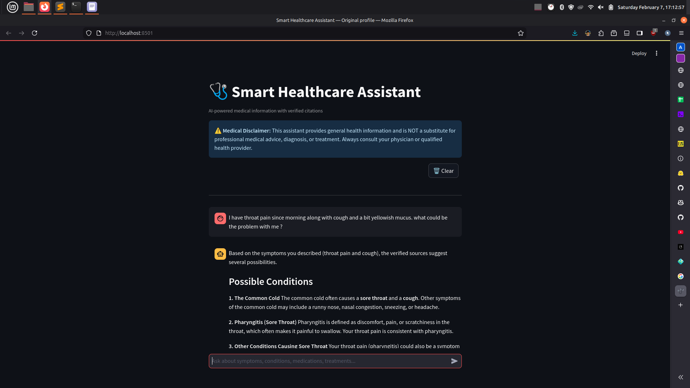
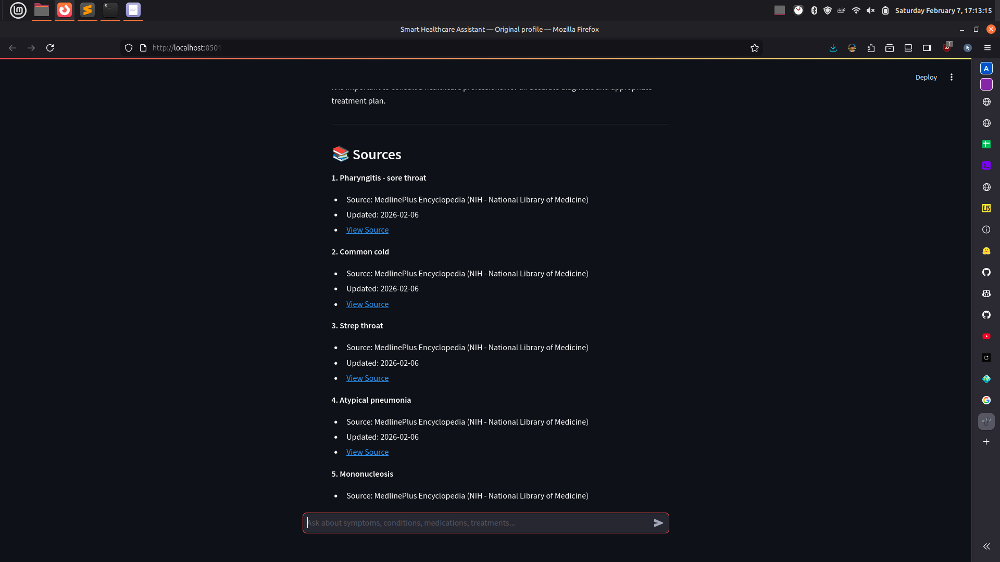

# Smart Healthcare Assistant (Multimodal RAG)

A Multimodal Retrieval-Augmented Generation (RAG) agent designed to serve as an intelligent medical chatbot. This application ingests medical data (e.g., from MedlinePlus), creates a searchable vector index, and provides a user-friendly chat interface to answer health-related queries with context-aware accuracy.




## Features

* **Multimodal Capabilities:** Capable of processing and understanding medical documents (PDFs, Text) containing rich information.
* **Automated Data Ingestion:** Includes scripts to fetch and preprocess verified medical data from sources like MedlinePlus.
* **RAG Pipeline:** Uses vector embeddings to retrieve the most relevant medical context before generating answers, reducing hallucinations.
* **Memory-Aware Chat:** The agent retains conversation history to provide follow-up answers in context.
* **Interactive UI:** Built with Streamlit for a clean, responsive user experience.
* **Automated Vectorization:** One-click script to convert raw medical documents into a vector database for efficient searching.

## Tech Stack

* **Language:** Python 3.9+
* **Frontend:** Streamlit
* **LLM Framework:** LangChain
* **Vector Store:** ChromaDB
* **Data Source:** MedlinePlus API
* **Models:** Google Gemini


## Installation & Setup

### Prerequisites
* Python 3.8 or higher installed.
* An API Key for your LLM provider (e.g., OPENAI_API_KEY or GOOGLE_API_KEY).

### 1. Clone the Repository
Clone the project files to your local machine:
```
git clone https://github.com/ritwikrazneesh/rag-medical-chatbot.git
cd multimodal-rag-medical
```
### 2. Create a Virtual Environment (Recommended)
It is best practice to run this project in a virtual environment.

**Windows**
```
python -m venv venv
venv\Scripts\activate
```
**Mac/Linux**
```
python3 -m venv venv
source venv/bin/activate
```
### 3. Install Dependencies
Install the required Python libraries:
```pip install -r requirements.txt```

### 4. Configure Environment Variables
Create a .env file in the root directory and add your API keys. This ensures the application can authenticate with the LLM provider.

```OPENAI_API_KEY=your_api_key_here```
or
```GOOGLE_API_KEY=your_google_key_here```

## Usage Guide

### Step 1: Ingest Data
Run the fetch script to download relevant medical articles or data from MedlinePlus. This prepares your raw data source.
```python fetch_medlineplus.py```

### Step 2: Build Vector Index
Convert the downloaded documents into a vector database. This step is crucial for the RAG system to perform semantic searches.
```python vectorize_documents.py```

### Step 3: Launch the Chatbot
Start the Streamlit application to interact with the chatbot.
```streamlit run app.py```

Once running, open your web browser to http://localhost:8501.


